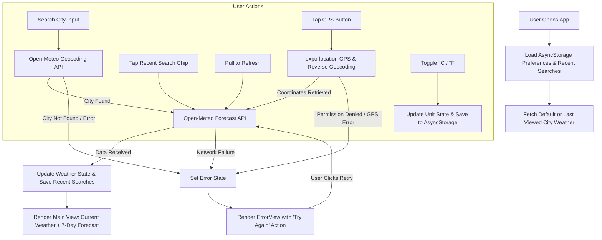

# 🌦️ WeatherCast - React Native Weather Application

A modern, fast, and intuitive weather forecast application built with **React Native** and **Expo Go**, using the free [Open-Meteo](https://open-meteo.com/) API (no API key required).

---

## 📱 Features

- 🔍 **City Search**: Instant global city search powered by Open-Meteo Geocoding.
- 🌡️ **Current Weather Overview**:
  - City name, region, and country
  - Real-time temperature and "feels like" metric
  - WMO-interpreted weather condition with dynamic weather icons
  - Relative humidity (%) and wind speed
- 📅 **7-Day Upcoming Forecast**: Daily breakdown with day names, weather conditions, and high/low temperatures.
- 🔄 **Pull-to-Refresh**: Seamless gesture to re-fetch the latest weather data.
- 📍 **Current Location**: 1-tap GPS location detection using `expo-location`.
- 🔁 **Celsius & Fahrenheit Toggle**: Instant unit switching with persistent preference.
- 🕒 **Recent Searches**: Quick-access horizontal chip list for previously searched cities, saved persistently using `AsyncStorage`.
- ⚠️ **Graceful Error Handling & Recovery**:
  - Handles invalid city searches and network errors gracefully.
  - Clear, user-friendly error messages with a **Try Again** retry button.

---

## 📲 Direct APK Download (Android)

You can download and install the standalone Android application directly (no Expo Go required):
👉 **[Download WeatherCast.apk (Latest)](https://expo.dev/artifacts/eas/f-BJOZ7UrMEM-_ckXPjmnFZB4p6XQR52TgOd9Ib8byA.apk)**

---

## 🚀 Getting Started

### Prerequisites
- **Node.js** (v18 or newer recommended, tested on v24)
- **npm** (v9 or newer)
- **Expo Go** mobile app installed on your smartphone:
  - [Android (Google Play Store)](https://play.google.com/store/apps/details?id=host.exp.exponent)
  - [iOS (Apple App Store)](https://apps.apple.com/app/expo-go/id982107779)

### Installation & Running

1. **Clone the repository**:
   ```bash
   git clone <YOUR_GITHUB_REPO_LINK>
   cd "Weather app"
   ```

2. **Install dependencies**:
   ```bash
   npm install
   ```

3. **Start the development server**:
   ```bash
   npx expo start
   ```
   *(Or `npm start`)*

4. **Launch on your device**:
   - **Android**: Open the **Expo Go** app and tap **"Scan QR code"** to scan the QR code displayed in your terminal or browser.
   - **iOS**: Open the native **Camera** app, point it at the QR code, and tap the prompt to open in **Expo Go**.
   - *Note: Ensure your phone and computer are connected to the same Wi-Fi network.*

---

## 🏗️ Architecture & State Flow

The application follows a clean, single-source-of-truth unidirectional state architecture.



### Folder Structure
```
weather-app/
├── App.js                       # Main application shell, state management & layout
├── app.json                     # Expo configuration, dark theme & permission strings
├── package.json                 # Project dependencies & scripts
└── src/
    ├── constants/
    │   └── theme.js             # Design tokens, color palettes, and spacing
    ├── services/
    │   ├── weatherApi.js        # Open-Meteo geocoding & forecast client, WMO parser
    │   └── storage.js           # AsyncStorage helper for recent searches & unit pref
    └── components/
        ├── SearchBar.jsx        # Search input with clear button & submit action
        ├── RecentSearches.jsx   # Horizontal chip list with 1-tap re-queries
        ├── CurrentWeather.jsx   # Weather card: temp, condition, humidity, wind
        ├── ForecastList.jsx     # 7-day daily forecast rows
        ├── LoadingView.jsx      # Loading spinner & status indicator
        └── ErrorView.jsx        # Friendly error message card with retry button
```

---

## 💡 Assumptions & Known Limitations

1. **No API Key Dependency**:
   - Open-Meteo was intentionally selected because it is free, open, and requires no API key registration. It avoids breaking candidate submissions due to expired or invalid credentials.
2. **Rate Limits**:
   - Open-Meteo provides up to 10,000 daily API calls for non-commercial use, which is more than sufficient for normal usage.
3. **Location Permission**:
   - The GPS feature requires user permission. If denied, the app gracefully presents an alert and allows manual search to continue uninterrupted.
4. **Network Connectivity**:
   - Offline caching is currently limited to storing the search history and unit preference. If offline, the app prompts the user with a retry button once reconnected.

---

## 🎯 Follow-up Discussion Guide

### 1. Implementation, Design Decisions & Steering the AI Assistant
- **Trade-offs**:
  - We opted for Expo Go rather than bare React Native to eliminate local compilation overhead (no Xcode / Android Studio required for reviewers), keeping setup time under 2 minutes.
  - We used standard React Native components and `@expo/vector-icons` to deliver a dark-mode glassmorphic interface with 0 external UI library bloat.
  - Used WMO standard code translation tables directly in `weatherApi.js` to avoid additional 3rd-party weather mapping libraries.
- **Steering the AI Assistant**:
  - Guided the agent to avoid approaches that would cause excessive bundle sizes or token exhaustion.
  - Directed the agent to prioritize high-value UX touches: persistent storage, pull-to-refresh, recent searches, °C/°F toggling, and retry mechanisms.

---

### 2. Sample JavaScript Coding Exercise (Arrays & Strings)

#### Problem: Filter and Format Recent Search History
```javascript
/**
 * Deduplicates search terms case-insensitively, trims whitespace,
 * capitalizes each word, and limits the list to N items.
 */
function cleanRecentSearches(searches, limit = 5) {
  const seen = new Set();
  const cleaned = [];

  for (const raw of searches) {
    if (typeof raw !== 'string') continue;
    const trimmed = raw.trim();
    if (!trimmed) continue;

    const normalizedKey = trimmed.toLowerCase();
    if (!seen.has(normalizedKey)) {
      seen.add(normalizedKey);
      // Capitalize first letter of each word (e.g. "san francisco" -> "San Francisco")
      const titleCased = trimmed
        .split(' ')
        .map(w => w.charAt(0).toUpperCase() + w.slice(1).toLowerCase())
        .join(' ');
      cleaned.push(titleCased);
      if (cleaned.length === limit) break;
    }
  }

  return cleaned;
}

// Example usage:
const inputs = ["tokyo", " LONDON ", "london", "NEW YORK", "tokyo", "paris"];
console.log(cleanRecentSearches(inputs, 4));
// Output: ["Tokyo", "London", "New York", "Paris"]
```

---

### 3. Packaging and Publishing to Google Play Store & Apple App Store

To package this application for production release:

1. **Configure Production Credentials in `app.json`**:
   - Set unique `bundleIdentifier` for iOS (e.g., `com.company.weathercast`) and `package` for Android.
   - Configure version code (`versionCode` for Android, `buildNumber` for iOS).
2. **Use Expo Application Services (EAS)**:
   ```bash
   npm install -g eas-cli
   eas login
   eas build:configure
   ```
3. **Build Binaries**:
   - **Android**: `eas build --platform android --profile production` (generates an `.aab` Android App Bundle).
   - **iOS**: `eas build --platform ios --profile production` (generates an `.ipa` archive signed with Apple Distribution Certificate).
4. **Store Submissions**:
   - **Google Play Store**: Upload `.aab` to Google Play Console under Internal Testing / Production, complete the App Content questionnaires (Data Safety, Privacy Policy), and submit for review.
   - **Apple App Store**: Upload `.ipa` to App Store Connect using `eas submit --platform ios`, configure App Privacy details, screenshots, and age ratings, and submit to TestFlight / App Store Review.

---

### 4. Push Notifications Architecture (FCM & APNs)

#### What are Push Notifications?
Push notifications are messages sent from a backend server to a user's mobile device, even when the application is in the background or killed. They are crucial for weather applications to send severe storm alerts, daily morning weather digests, or sudden temperature drops.

#### Architecture & Lifecycle:

```
[Mobile App] 
     │  1. Request user permission
     │  2. Generate device push token (via expo-notifications / FCM / APNs)
     ▼
[Your Backend Server] 
     │  3. Store token linked to User/Device ID & location preference
     │  4. Weather alert triggered (e.g., NOAA/Open-Meteo storm alert)
     ▼
[Push Gateway]
 ┌───┴──────────────────────────────┐
 ▼                                  ▼
[Apple Push Notification (APNs)]   [Firebase Cloud Messaging (FCM)]
 │                                  │
 ▼ (iOS Devices)                    ▼ (Android Devices)
[User's iPhone]                    [User's Android Phone]
```

#### Key Supporting Components:
1. **Frontend (`expo-notifications` or `@react-native-firebase/messaging`)**:
   - Calls `registerForPushNotificationsAsync()` to retrieve the push token (`ExponentPushToken[...]` or FCM registration token).
   - Listens for background and foreground notifications.
2. **Backend Server**:
   - Maintains a `users_push_tokens` database table storing `{ userId, token, platform, lastLatitude, lastLongitude }`.
   - A cron job or webhook triggers when severe weather is detected, sending targeted push payloads to Apple's HTTP/2 APNs API or Firebase's FCM v1 HTTP API.
3. **APNs vs. FCM**:
   - **APNs**: Apple's native gateway. Requires an Apple Developer Account, a `.p8` Auth Key or APNs certificates, and Team ID.
   - **FCM**: Google's service for Android (and cross-platform). Uses a Google Service Account JSON file for server-side authentication.
